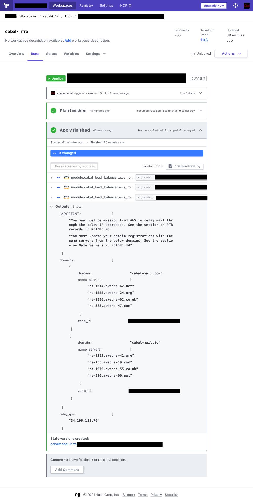

# cabal-infra
Creates AWS infrastructure and machine configuration for a Cabalmail system -- a system for hosting and managing your personal email.


WARNING: This should not be regarded as an enterprise or ISP-grade email solution. It has been tested on a small pool of users for their personal email. Use at your own risk!

# About
Cabalmail is a suite of infrastructure code ([Terraform](https://www.terraform.io/)) and configuration management code ([Chef Infra](https://www.chef.io/)) that together create the following system components:

* IMAP hosts
* SMTP relay hosts
* SMTP submission hosts
* Administrative interface for managing addresses
* DNS and other supporting infrastructure

Cabalmail allows you to host your email and to create multiple unique addresses that all point to the same inbox. This allows you to give distinct email address to all the people, institutions, corporations, etc., from whom you wish to receive email, allowing fine-grained control of who is authorized to insert messages into your inbox.

For the curious, here is [a brief history of Cabalmail](./docs/genesis.md).

## Subdomains

What's special about Cabalmail is that it allows (OK: forces) you to create new subdomains for each address. If we assume your mail domain is example.com, then Cabalmail will *not* support addresses of the form foo@example.com. Rather, each address will be hosted at a subdomain of example.com, such as foo@bar.example.com.

By making it easy to create new addresses that point to a given inbox, Cabalmail makes it feasible to create new addresses for each person, company, etc., that needs to contact you. This approach is similar to the technique of ["plus-addressing" or "subaddressing"](https://tools.ietf.org/id/draft-newman-email-subaddr-01.html).

"So why not just use plus-addressing?" Good question. See the next section.

## Spam Handling

There isn't any. Nor is there a "Junk" folder (unless a user creates one). By not running Bayesian filters, machine learning algorithms, or other compute-intensive measures, you can operate your own email infrastructure with very small machines. Mine (which serves seven domains and four users) runs just fine on four t2.micros. My monthly AWS cost is less than $100. That's a lot of money in a world of free Gmail accounts, but if you value enhanced control and privacy, you may find it worthwhile. And bear in mind that you can spread the cost among several users.

"But what if I start to get spam?" That's the best part. Simply go to the admin interface and revoke the address. This process does more than simply remove the address from your aliases; it also revokes any related DNS records. Because each address has a unique subdomain, the spam-sending relays can't even find your SMTP servers, so there is no need for your machines to accept the connection, evaluate the reputation of the sender, match the To: header against a list of supported addresses, apply spam filters, etc.

You _could_ use a Cabalmail system along with client-side spam filters, but I recommend against it. Client-side spam filters process mail only after your servers have received and processed it. This hides the spam from you at the cost of gradually (or not-so-gradually) increasing the load on your infrastructure. By making your spam visible, you can easily intercede to reduce load on your infrastructure and keep humming along with small machines. Also, you eliminate false positives; never again will important mail be misidentified as junk.

You also _could_ create a single address on a Cabalmail system and just give that out to everyone like a normal address. But if you do, get ready to take a fresh look at those client-side spam filters.

## Use Case

Admitedly, Cabalmail serves a specialized use case, which is definitely not for everyone. To get the benefits of a Cabalmail system, you must get used to creating a new email address *each and every time you provide your contact information to a third party.* The administrative interface makes this easy, but it _is_ an additional step.

# Set Up

## Prerequisites

Before using this repo, you must set up an appropriate environment.

### Fork this repository

Although you could connect Terraform Cloud directly to the original repository, it is safer to fork it. If you want to contribute to it, or extend it for your your own use, then forking is essential. Use the Github URL for your fork where called for in tfvars.

### AWS Account

[Set up an AWS Account](./docs/aws.md).

### Terraform

[Set up Terraform](./docs/terraform.md).

### Domain registration

You must register your desired domains (control and mail) with your chosen registrar. Cabalmail requires exactly one control domain and at least one mail domain. Registration requires an email address. You can use a temporary account with any of the free providers for this address, and later, you can update the registration records with a self-hosted address once your hosting infrastructure is up and running.

The control domain is for infrastructure, not for email addresses. If you like to send mail from example.com, you might use example.net as your control domain. If so, then you would retrieve your mail from imap.example.net, send mail to smtp-out.example.net, and manage your addresses at admin.example.net.

## Provisioning

1. Set up the prerequisites above.
2. Queue a plan in your Terraform Cloud terraform/dns workspace.
3. When it finishes the plan phase, confirm and apply.
4. The output will include name servers. Update the domain registration with these name servers.
5. The output will also include a zone ID. Update the `zone_id` variable for the terraform/infra workspace with this ID.
6. Queue a plan in your Terraform Cloud terraform/cert workspace.
7. When it finishes the plan phase, confirm and apply.
8. Queue a plan in your Terraform Cloud terraform/infra workspace.
9. When it finishes the plan phase, confirm and apply.

## Reprovisioning

You can rerun the provisioning steps any time. If you have not changed anything in the code or in the variables, the operation should be safe. At worst, it will update the AMI on which the machines run, resulting in new machines being launched, but no mail will be lost, with the rare exception of mail that had been queued for redelivery following a transitory error.

Theoretically, it should also be safe to change any of the variables except the AWS region. As long as the new values are sensible, Terraform should reestablish the infrastructure with the new parameters, and your mail should still be there. But we do not guarantee this, and we strongly recommend that you perform backups first.

## Post-Automation Steps

Look at the output from Terraform! If you are using Terraform Cloud, it is not shown by default; you have to expand it.

<a href="./docs/output.jpg"></a>

It should look something like this:

```json
{
  "IMPORTANT": [
    "You must get permission from AWS to relay mail through the below IP addresses. See the section on PTR records in README.md.",
    "You must update your domain registrations with the name servers from the below domains. See the section on Name Servers in README.md"
  ],
  "domains": [
    {
      "domain": "example.com",
      "name_servers": [
        "ns-1111.awsdns-55.net",
        "ns-2222.awsdns-66.org",
        "ns-3333.awsdns-77.co.uk",
        "ns-4444.awsdns-88.com"
      ],
      "zone_id": "Z0431XXXXXXXXXXXXXXX0"
    },
    {
      "domain": "example.org",
      "name_servers": [
        "ns-1111.awsdns-55.org",
        "ns-2222.awsdns-66.com",
        "ns-3333.awsdns-77.net",
        "ns-4444.awsdns-88.co.uk"
      ],
      "zone_id": "Z0431XXXXXXXXXXXXXXX1"
    }
  ],
  "relay_ips": [
    "192.168.0.1"
  ]
}
```

### Name Servers (What to do with the `domains` output)

The output contains the name servers that AWS assigned to your mail domains. To work at all, you must update your domain registrations with these name servers. Consult your registrar for instructions on changing your DNS servers. If you use AWS as your registrar, you can follow their instructions [here](https://docs.aws.amazon.com/Route53/latest/DeveloperGuide/domain-name-servers-glue-records.html).

### PTR Records and Port 25 Block (What to do with the `relay_ips` output)

The output contains the IP address of each of your outgoing mail relay. In order to send mail reliably, you must [set up PTR records](https://blog.mailtrap.io/ptr-record/) for the outgoing SMTP server, and [get AWS to allow outbound traffic on port 25](https://aws.amazon.com/premiumsupport/knowledge-center/ec2-port-25-throttle/). There is no API for this, so the process cannot be automated. Both tasks can be accomplished by filling out [this form](https://console.aws.amazon.com/support/contacts?#/rdns-limits) for each outgoing SMTP IP address.

# Backups

The code in this repository *does not* establish any form of backup. Mail is stored in AWS Elastic File System, and address data is stored in DynamoDB. AWS EFS is designed to achieve [99.999999999% (eleven nines) durability](https://aws.amazon.com/efs/faq/#Data_protection_.26_availability). AWS does not publish a durability rating for DynamoDB, but they [do say](https://docs.aws.amazon.com/amazondynamodb/latest/developerguide/Introduction.html#ddb_highavailability) that they replicate DynamoDB tables across multiple availability zones for "high durability".

You are responsible for your own backups.

# Everyday Use

See the [User Manual](./docs/user_manual.md) for instructions on using the included application for creating and revoking email addresses.