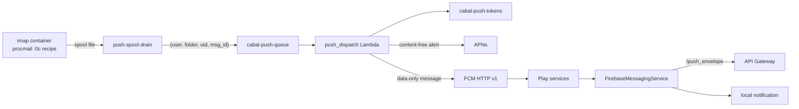

# Android Push Notifications Plan

## Context

The Apple clients have had server-originated push since 0.11.0: a procmail delivery hook on the `imap` tier spools a content-free wake signal, a drain daemon forwards it to SQS (`cabal-push-queue`), and the `push_dispatch` Lambda fans it out to registered device tokens via APNs, with on-device enrichment through `/push_envelope` so Apple's infrastructure never sees message content. The as-implemented documentation is [docs/push-notifications.md](../push-notifications.md); the original plan (with errata) is [docs/0.11.x/push-notifications.md](../0.11.x/push-notifications.md).

The Android client ([android/](../../android/)) currently learns about new mail through `NewMailSync` ([android/app/src/main/kotlin/com/cabalmail/android/notifications/NewMailSync.kt](../../android/app/src/main/kotlin/com/cabalmail/android/notifications/NewMailSync.kt)): an opt-in WorkManager periodic job at the 15-minute floor that STATUSes INBOX over the API, tracks a `uidNext` watermark, and posts local notifications. It works, but 15 minutes is the floor, INBOX is the only folder, and the poll costs battery and API traffic whether or not mail arrived. The Android-client plan's "Out of Scope" section deferred FCM push, and its erratum already records that the original blocker no longer exists: FCM support is now an extension of the shipped pipeline, not a new architecture.

This plan adds Firebase Cloud Messaging (FCM) as a second sender in that pipeline. Everything upstream of the dispatch Lambda — procmail hook, spool, drain, queue, token table, enrichment endpoint, token GC — is platform-agnostic and is reused unchanged.

## Goals

- New mail produces an Android system notification within seconds of delivery, not within 15 minutes.
- The same privacy posture as the Apple path: Google's infrastructure sees a wake signal (folder, UID, Message-ID), never sender, subject, or body. Enrichment happens on-device against `/push_envelope` with the user's own JWT.
- Registration is reversible and per-device via the existing `/push_register` / `/push_deregister` endpoints and `cabal-push-tokens` rows; sign-out or uninstall stops pushes without operator involvement.
- Per-folder opt-in with the same `enabled_folders` semantics as the Apple clients (default INBOX-only, `*` for everything).
- Clean degradation: a device without Google Play services, or an environment without FCM credentials, falls back to the existing WorkManager poll. Push is an upgrade, never a new requirement.
- The FCM credential is inert-by-default like the APNs key: Terraform seeds a placeholder, the operator provisions the real secret manually, and an unconfigured environment drops Android sends cleanly without disturbing Apple sends.

## Non-goals

- **UnifiedPush / self-hosted distributors.** The repo's `ntfy` image could serve as a UnifiedPush distributor for a zero-Google path, but it requires either a persistent device connection or a separate distributor app, and the distribution channel is the Play internal track where Play services is a given. FCM data-only messages are the pragmatic default; UnifiedPush could layer on later without changing the wake-signal design.
- **Encrypted payloads.** Same reasoning as the Apple plan's Pattern B rejection: the backend already has plaintext IMAP access, and the payload carries no content to encrypt. Wake-signal + on-device fetch is the design.
- **`notification`-block FCM messages.** FCM can render notifications itself from a `notification` payload; that path is explicitly rejected — it would require putting sender/subject in the payload (through Google) and forfeits enrichment, dedup, and grouping control. Data-only messages, always.
- **Web push for the React admin app.** Different API surface, different consent flow, second-class client. Out of scope.
- **Replacing foreground refresh.** While the app is visible it polls (and will get an in-app refresh nudge from the push signal); push primarily serves the backgrounded/closed app.

## What Google requires

FCM is the one part of this that code alone cannot provide. The legacy FCM server-key API was shut down in June 2024; the **HTTP v1 API** is the only route, and it authenticates with a Google service account. One-time setup, per environment:

1. **Create a Firebase project** ([console.firebase.google.com](https://console.firebase.google.com), same Google account as the Play Console but a separate console). Decline Google Analytics — it is not needed and adds a data-sharing surface. One project per environment (stage, prod): distinct sender IDs mean stage client builds cannot be pushed with prod credentials, mirroring the per-environment APNs posture.
2. **Register the Android app** in the project with package name `com.cabalmail.android`. Note the four client-side config values Firebase generates: project ID, application ID (`1:<number>:android:<hash>`), API key, and sender ID (the project number). These are not secrets (they ship inside every APK), but they are per-environment, so they are injected like the control domain rather than committed — see client components below. The `google-services.json` download can be skipped entirely.
3. **Mint the server credential.** Do not use the default `firebase-adminsdk` service account (it carries project-Editor). Create a dedicated service account in the underlying GCP project with only the **Firebase Cloud Messaging API Admin** role (`roles/firebasecloudmessaging.admin`), and generate a JSON key for it. This key is the FCM analog of the APNs `.p8`: whoever holds it can push arbitrary data messages to every registered Android device.
4. **Seed SSM** (from CloudShell in the target account, matching the [runtime-secrets posture](../push-notifications.md#provisioning-the-apns-key) — manual `put-parameter`, never Terraform state or CI):

   ```bash
   aws ssm put-parameter --name /cabal/fcm/service_account --type SecureString \
     --value file://cabal-fcm-<env>.json --overwrite
   ```

There is no fee for FCM and no quota that a mail workload approaches. The Cloud Messaging API is enabled by default on new Firebase projects.

### Rotating the FCM credential

Google allows up to ten keys per service account, so rotation is create-new → update SSM → wait for warm Lambda containers to recycle (or force with a no-op `update-function-configuration`) → delete old key, the same shape as APNs key rotation. Deleting first inverts the order and takes Android push down until the new key lands.

## Architecture



Everything left of `push_dispatch` is untouched. The dispatch loop already iterates the user's token rows and branches per row (that is how macOS gets silent pushes while iOS gets alerts); Android becomes a third branch selected by the row's `platform`, sending through a new FCM client instead of the APNs one.

On the device, the flow is the Apple NSE dance without the extension: data-only FCM messages never render anything themselves — they invoke the app's `FirebaseMessagingService.onMessageReceived`, ordinary app code, which fetches the envelope with the user's JWT and posts the notification locally. No separate target, no App Group, no token mirroring. If the fetch fails, a generic "New mail" notification posts instead, so nothing is dropped silently.

## Backend components

### `push_register` / `push_deregister`

- Add `com.cabalmail.android` → `android` to `ALLOWED_BUNDLE_IDS` in [lambda/api/push_register/function.py](../../lambda/api/push_register/function.py). For APNs rows `bundle_id` doubles as the topic; for Android it selects the FCM send path (the v1 API scopes to the Firebase project, not a topic).
- **Token validation must branch on platform.** `DEVICE_TOKEN_RE` is APNs-specific (`^[0-9a-f]{16,400}$`); FCM registration tokens are opaque strings around 140–200 characters drawn from `[A-Za-z0-9_:-]` (they typically contain a `:`), and are documented as subject to change. Validate Android tokens against a charset-and-length bound (`^[A-Za-z0-9_:\-]{16,400}$`), keyed off the validated `bundle_id`. The same branch applies to `push_deregister`'s token check. Do not lowercase FCM tokens — they are case-sensitive, unlike APNs hex.
- `enabled_folders` semantics, the merge-style upsert, and the tri-state absent/empty/present handling carry over with no changes.

### `push_dispatch`

- **New `fcm.py` sibling to `apns.py`.** The transport is simpler than APNs — the v1 API is ordinary HTTPS JSON, no HTTP/2 requirement — but auth is heavier: sign an RS256 JWT with the service-account key, exchange it at `https://oauth2.googleapis.com/token` for a Bearer token (scope `https://www.googleapis.com/auth/firebase.messaging`, ~1 hour lifetime, cached per warm container like the APNs provider token), then POST to `https://fcm.googleapis.com/v1/projects/<project_id>/messages:send` (project ID read from the service-account JSON). The zip keeps `push_dispatch`'s deliberate pure-Python posture (see the rationale in its [requirements.txt](../../lambda/api/push_dispatch/requirements.txt)): `ecdsa` cannot do RSA, so add the pure-Python `rsa` package for the one PKCS#1 v1.5 SHA-256 signature per token refresh, and use `urllib` for the HTTPS calls — no `h2` needed on this path. Implementation may first try the self-signed-JWT variant (JWT with `aud: https://fcm.googleapis.com/` used directly as the Bearer, skipping the exchange round trip); if FCM rejects it, the OAuth exchange is the documented fallback.
- **Message shape.** Data-only, high priority, TTL matched to the queue's one-hour staleness posture (all `data` values must be strings — FCM rejects non-string values):

  ```json
  {
    "message": {
      "token": "<device token>",
      "data": {"folder": "INBOX", "uid": "4271", "msg_id": "<...>"},
      "android": {"priority": "HIGH", "ttl": "3600s"}
    }
  }
  ```

  High priority is what exempts the delivery from Doze/app-standby throttling, and it is policy-compliant here precisely because every message results in a user-visible notification (high-priority messages that don't are what get an app deprioritized).
- **Dedup is client-side, not collapse-key.** APNs `apns-collapse-id` has no clean FCM analog — `collapse_key` only collapses messages queued while the device is offline and FCM keeps at most four collapse keys per device, so per-message keys would silently drop older queued signals. Instead the Android app posts notifications with an ID derived from the message identity (`NewMailSync` already keys on the UID), so a redelivered signal replaces, rather than stacks on, the notification it already produced — the same end state, enforced at the display layer the app controls anyway. No `collapse_key` is sent.
- **Error mapping onto the existing prune/retry split.** `UNREGISTERED` (HTTP 404) and token-shaped `INVALID_ARGUMENT` (400) → permanent, delete the row (the uninstalled-app hygiene APNs gets from 410). `SENDER_ID_MISMATCH` (403) → permanent, prune with a loud log (the token belongs to a different Firebase project — an environment misconfiguration that re-registration under the right config heals). `QUOTA_EXCEEDED` (429), 500, `UNAVAILABLE` (503) → retryable. Transport errors follow the APNs pattern: caught per token so one failure never strands the remaining devices, and the record retries only when nothing was delivered.
- **Unconfigured posture, now per-sender.** Today the handler consults the single APNs client before doing anything and drops the signal when unconfigured. With two senders that check moves per-row: group the user's rows by platform and let each sender's unconfigured state skip only its own rows, with the same placeholder-sentinel (`/cabal/fcm/service_account`) and `NOT_CONFIGURED_TTL_SECONDS` recheck the APNs client uses. An environment with only an Apple app, only an Android app, or neither must behave exactly as it does today: clean drops, no DLQ backlog. The handler's "raise only when nothing was delivered" contract is unchanged.
- **Metrics.** The EMF emission gains a `Platform` dimension on `Sent`/`Failed` so an FCM-only failure mode is visible without spelunking logs; the undimensioned totals remain for continuity.

### Reused unchanged

`/push_envelope` (the Android service calls it exactly like the NSE does), `push_token_gc` (Android rows carry the same `last_seen_at` bookkeeping), the spool/drain/queue path, and the `cabal-push-tokens` schema.

### Terraform

- `aws_ssm_parameter` `/cabal/fcm/service_account`: SecureString, placeholder value, `ignore_changes = [value]` — the same seed-and-ignore pattern as the four `/cabal/apns/*` parameters in [terraform/infra/modules/app/push_dispatch.tf](../../terraform/infra/modules/app/push_dispatch.tf).
- Extend the `push_dispatch` role's SSM read grant from the `/cabal/apns` path to also cover `/cabal/fcm`.
- No new Lambda, queue, table, or IAM principal. No ECS or docker changes.

## Client components

### Firebase wiring without the plugin

Skip the `google-services` Gradle plugin and `google-services.json` entirely. Initialize manually with `FirebaseOptions.Builder` from `BuildConfig` fields, fed by Gradle properties alongside the existing `cabalmail.controlDomain` (checked-in defaults are placeholders; real per-environment values live in `~/.gradle/gradle.properties` and, later, CI properties):

- `cabalmail.fcmProjectId`, `cabalmail.fcmApplicationId`, `cabalmail.fcmApiKey`, `cabalmail.fcmSenderId`

This keeps per-environment config out of the public repo, keeps the `kit` module free of Firebase (the dependency lands in `app` only — `firebase-messaging` via the version catalog, dependabot-owned like everything else), and keeps CI green with placeholders: when the project ID is the placeholder, or Play services is unavailable on the device, the app simply never attempts FCM registration and the WorkManager poll remains the notification path. Android Lint's warnings-as-errors and ktlint apply as usual; no workflow changes are needed (`android.yml` deploys nothing to AWS, and none of this changes that).

### Registration lifecycle

- After sign-in (and on every app launch while signed in), request the FCM token (`FirebaseMessaging.getInstance().token`) and POST it to `/push_register` with `bundle_id: com.cabalmail.android`, app version, and locale — the merge-style upsert means re-registration never clobbers a folder selection the app isn't sending.
- `FirebaseMessagingService.onNewToken` re-registers on rotation. The previous token's row dies naturally via `UNREGISTERED` pruning or the 90-day GC; no client-side bookkeeping of old tokens.
- Sign-out calls `/push_deregister` with the current token before dropping credentials, mirroring the Apple clients.
- The existing Settings notifications opt-in (`notificationsEnabled`, which already owns the `POST_NOTIFICATIONS` runtime prompt on API 33+) gates the whole feature: enabling it registers for push where available and schedules the poll as backstop; disabling it deregisters and cancels the poll.

### Receiving

`onMessageReceived` gets the `{folder, uid, msg_id}` data map and:

1. Checks the row-side folder opt-in was already applied server-side (dispatch filters by `enabled_folders`), so no client-side folder filtering is needed.
2. Fetches sender/subject via `/push_envelope` with the stored JWT (refreshing via the existing token store if expired — unlike the iOS NSE, this is the full app process with the full auth stack available).
3. Posts the notification through the existing `NewMailSync` presentation layer: same `new_mail` channel, same group/summary behavior, same `EXTRA_FOLDER`/`EXTRA_UID` deep-link into `MainActivity`, notification ID keyed on the UID (which is also what makes redelivery idempotent). On enrichment failure, posts the generic "New mail" fallback with the deep link intact.
4. When the app is in the foreground, skips the banner and emits the existing `MailEvents` refresh instead — the visible list updating is the notification, matching the Apple clients' foreground suppression.

Data-only messages at high priority reach `onMessageReceived` even when the app is backgrounded or stopped; the ~10-second execution budget is ample for one HTTPS fetch plus a local post.

### Interplay with the WorkManager poll

The poll is not removed. It becomes the backstop for devices without Play services, environments without FCM credentials, and pushes lost to the one-hour TTL. Because both paths post through the same UID-keyed notification IDs and the poll's `uidNext` watermark advances regardless of who notified first, the two paths cannot double-notify. A later refinement may lengthen the poll interval when push registration is known-healthy; ship with both at current behavior first.

## Privacy posture

What Google's infrastructure sees per push — deliberately isomorphic to [what APNs sees](../push-notifications.md), minus even the alert string (data-only messages carry no display text at all):

- The registration token it already issued, and the package name.
- An AWS egress IP (the dispatching Lambda's NAT address).
- A payload of folder name, UID integer, and Message-ID string. No sender, subject, body, or recipient address.
- Timestamp.

Enrichment is one HTTPS call from the device to our own API with the user's own JWT — the same call shape the app makes constantly during normal use. On-device, Play services routes the message envelope to the app, but message content never transits Google's servers because it is never in the message. The Firebase project is created without Google Analytics, so no additional telemetry surface ships with the SDK dependency. The Play data-safety declaration should be reviewed when this ships (the FCM token is a device identifier collected for app functionality); that is a Play Console form edit, not code.

The service-account JSON is the high-value secret, held only in SSM SecureString readable only by the `push_dispatch` role, rotated per the runbook section above. Blast radius of a leak: arbitrary *data* messages to Cabalmail devices — the app renders nothing it doesn't fetch and verify from our own API, which meaningfully blunts spoofing compared to display-payload push.

## Phasing

Each phase is independently shippable and inert until the next one lands. Android remains outside the tester/fixer lifecycle, so verification is the operator's own UAT throughout.

### Phase 1: Backend FCM sender (inert)

- `fcm.py` client with OAuth/self-signed-JWT auth, `rsa` dependency, error taxonomy mapped to the prune/retry split.
- Per-platform dispatch restructure in `push_dispatch/function.py` (row grouping, per-sender unconfigured drops, `Platform` metric dimension).
- `push_register`/`push_deregister` bundle-ID and token-format branches.
- Terraform: `/cabal/fcm/service_account` placeholder + IAM path grant.
- Tests in the `_shared/tests` style: token validation branches, payload shape (string-valued data, priority, TTL), error mapping, and the two-sender unconfigured matrix (APNs-only, FCM-only, neither, both).
- Ships to stage and prod safely: no Android tokens exist, the credential is a placeholder, and Apple dispatch behavior is bit-identical.

### Phase 2: Firebase provisioning (operator, stage first)

- Create the stage Firebase project, register the package, mint the least-privilege service account, seed SSM.
- Verify the sender directly: insert a test token row for the shared stage `claude` account, send a message to a local emulator build with hand-wired Firebase config, confirm delivery and `UNREGISTERED` pruning with a garbage token.
- Prod repeats this once phase 3 is validated on stage.

### Phase 3: Client registration and receive

- `firebase-messaging` dependency (app module only), manual `FirebaseOptions` init from Gradle-property `BuildConfig` fields with placeholder gating.
- `FirebaseMessagingService`: `onNewToken` registration, `onMessageReceived` enrich-and-post via the `NewMailSync` presentation layer, foreground suppression via `MailEvents`.
- Registration after sign-in, deregistration on sign-out, all gated by the existing Settings opt-in.
- Play-services-absent and placeholder-config fallbacks verified: the poll continues to carry notifications.
- Changelog fragment with `Android:` prefix (this is the headline feature of its release).

### Phase 4: Per-folder opt-in

- Settings folder picker writing `enabled_folders` through `/push_register`, defaulting to INBOX-only, `*` supported — per-device on the token row, exactly like the Apple clients (not mirrored into `/set_preferences`, matching the shipped Apple erratum).
- The WorkManager poll stays INBOX-only; folder-scoped push is a push-path feature.

### Phase 5: Notification actions

- `Mark as Read` and `Archive` actions via `NotificationCompat.Action` + a `BroadcastReceiver` calling `/set_flag` / `/move_messages` with WorkManager-backed retry, mirroring the Apple category actions.
- Archive folder discovery copies the shipped Apple behavior: find the folder named "Archive" (case-insensitive) via `/list_folders`, cache it, degrade the action to absent when there is none.

### Phase 6: As-implemented documentation

- Fold Android into [docs/push-notifications.md](../push-notifications.md): FCM provisioning and rotation alongside the APNs sections, the per-sender dispatch behavior, and the client fallback matrix. This plan stays in `docs/1.x/` as the historical record, with errata if implementation diverges.

## Operational concerns

- **Quiesce** is unchanged: no delivery → no signals; the Lambda idles free. The FCM credential needs no scale-down.
- **Queue/DLQ semantics** are unchanged; a DLQ entry still means "the mail itself was delivered normally."
- **Token hygiene**: `UNREGISTERED` pruning plus the existing weekly `push_token_gc` backstop cover Android rows with no changes.
- **Mixed-platform users** (an iPhone and a Pixel on one account) get one notification per device from a single queue signal, each enriched independently — no cross-platform coordination exists or is needed.
- **Failure isolation**: an expired/revoked FCM credential surfaces as `Failed` with `Platform=android` and retryable errors aging into the DLQ, while Apple sends continue untouched; the fix is an SSM re-seed, no deploy.

## Open questions

- **Self-signed JWT vs OAuth exchange.** Try the exchange-free variant first in phase 1; it removes a per-hour round trip and a failure mode. If FCM's auth layer rejects self-signed JWTs, the exchange is a well-trodden fallback and the cached-token structure is identical either way.
- **Poll relaxation.** Once push is proven, should a healthy registration stretch the 15-minute poll to hourly (battery/API savings) or leave it (redundancy)? Decide with real-device data after phase 3; ship conservative.
- **Heads-up importance.** The `new_mail` channel is `IMPORTANCE_DEFAULT` (no heads-up peek). Whether push-era mail warrants `IMPORTANCE_HIGH` is a UX call the user makes per-device anyway via channel settings; default stays as-is unless UAT says otherwise.
- **Emulator coverage without Play services.** CI emulators and AOSP images lack Play services, which is exactly the fallback path — convenient for testing degradation, useless for testing push. Push-path verification stays manual on the physical devices until that changes.
