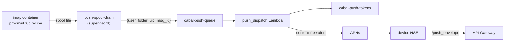

# Push notifications

The Apple clients receive new-mail notifications via the Apple Push
Notification service (APNs). The design keeps message content out of Apple's
infrastructure: the server sends a content-free wake signal, and the device
enriches it locally before display.

## How it works



1. Procmail fires a carbon-copy (`:0c`) recipe after each local delivery on
   the `imap` tier. `push-enqueue.sh` writes one JSON wake signal into
   `/var/spool/cabal-push`; the `push-spool-drain` supervisord program
   forwards spool files to the `cabal-push-queue` SQS queue and ages out
   anything it cannot send within an hour. The split keeps the delivery path
   fast and credential-free: the per-user delivery agents never hold AWS
   credentials, and a slow or unreachable queue never blocks or fails mail
   delivery. Messages the spam rule files away are never enqueued.
2. The `push_dispatch` Lambda consumes the queue, looks up the recipient's
   registered device tokens in the `cabal-push-tokens` DynamoDB table,
   filters by each token's folder opt-in, and sends one APNs request per
   device. The payload is `"New mail"` plus a message reference — no sender,
   subject, or body.
3. On the device, the app's Notification Service Extension calls
   `/push_envelope` with the user's own Cognito JWT to fetch
   sender/subject/snippet and rewrites the notification before it is shown.
   If that fails (offline, token expired, timeout), the generic `"New mail"`
   alert ships instead.
4. Devices register tokens through `/push_register` (on every app launch and
   token rotation) and remove them through `/push_deregister` (sign-out).
   `push_dispatch` also prunes tokens APNs reports as gone (`410
   Unregistered`, `BadDeviceToken`), so an uninstalled app stops receiving
   pushes without operator involvement.

What APNs sees per push: the device token it already knows, the app's bundle
id, an AWS egress IP, and a payload containing only the alert text `"New
mail"`, a folder name, a UID integer, and a Message-ID string.

## Provisioning the APNs key

Push is inert until an APNs auth key is provisioned; without one,
`push_dispatch` logs that it is unconfigured and drops wake signals (they do
not pile up in the DLQ). Per environment:

1. In [App Store Connect](https://appstoreconnect.apple.com) → Users and
   Access → Integrations → Keys, create a key with the **Apple Push
   Notifications service** enabled. Download the `.p8` file (one chance) and
   note the **Key ID** and your **Team ID**.
2. Populate the SSM parameters (from CloudShell in the target account):

   ```bash
   aws ssm put-parameter --name /cabal/apns/team_id --type SecureString \
     --value 'YOURTEAMID' --overwrite
   aws ssm put-parameter --name /cabal/apns/key_id --type SecureString \
     --value 'YOURKEYID' --overwrite
   aws ssm put-parameter --name /cabal/apns/private_key --type SecureString \
     --value file://AuthKey_YOURKEYID.p8 --overwrite
   ```

3. Development-signed builds (Xcode direct installs) register **sandbox**
   tokens; TestFlight and App Store builds register **production** tokens.
   The endpoint is per-environment:

   ```bash
   # only for an environment serving development-signed builds:
   aws ssm put-parameter --name /cabal/apns/endpoint --type SecureString \
     --value 'https://api.sandbox.push.apple.com' --overwrite
   ```

   The default is the production endpoint. A token sent to the wrong
   endpoint fails with `BadDeviceToken` and is pruned; re-launching the app
   re-registers it.

One key works for every app under the same team (iOS and macOS); the
dispatch Lambda selects the APNs topic from each token's registered bundle
id. The same key can be shared across environments or issued per environment
— Apple allows two active APNs keys per team, which is also what makes
rotation possible.

## Rotating the APNs key

The `.p8` key is high-value: whoever holds it can send arbitrary
notifications to every Cabalmail device. It is stored only in SSM
(SecureString), readable only by the `push_dispatch` Lambda role. To rotate:

1. Create a second APNs key in App Store Connect (do not revoke the old one
   yet).
2. Update `/cabal/apns/key_id` and `/cabal/apns/private_key` in each
   environment.
3. Wait for in-flight Lambda containers to recycle (or force it:
   `aws lambda update-function-configuration --function-name push_dispatch
   --description "key rotation $(date +%F)"`), and confirm pushes still
   arrive.
4. Revoke the old key in App Store Connect.

Revoking first inverts the order of operations and takes push down until the
new key lands everywhere.

## Client-side manual steps

The iOS/macOS app needs one-time Apple developer setup before registration
works on real devices:

- Enable the **Push Notifications** capability on the app's App ID (and the
  Notification Service Extension's App ID) in the developer portal, then
  regenerate any manual provisioning profiles CI uses — an entitlement change
  invalidates them.
- The Notification Service Extension ships as its own bundle id with its own
  App Store profile; CI expects its profile UUID alongside the app's.

## Operational notes

- **Queue and DLQ.** `cabal-push-queue` retains signals for one hour (a
  stale "new mail" push is noise, not news) and dead-letters to
  `cabal-push-dlq` after 5 failed receives. DLQ depth is visible in the SQS
  console; messages there are safe to purge — the mail itself was delivered
  normally.
- **Logs and metrics.** Dispatch logs at `/cabal/lambda/push_dispatch`
  (CloudWatch), including token prunes and per-send failures. Each
  invocation emits `Sent` / `Failed` / `LatencyMs` metrics in the
  `Cabal/Push` namespace via CloudWatch EMF.
- **Quiesce.** A quiesced environment delivers no mail, so nothing is
  enqueued. Residual signals from before the quiesce age out of the queue
  (and the container spool) within the hour. The Lambda itself costs nothing
  while idle and is not scaled down.
- **Spool.** `/var/spool/cabal-push` inside the imap container is sticky
  world-writable (like `/tmp`); the drain daemon authenticates each signal
  file by comparing its owner to the user it names, drops malformed or
  stale files, and the enqueue side sheds new signals if the spool backs up
  past 1000 files. The spool is container-local scratch — it is not on EFS
  and does not survive a task replacement, which loses at most the last
  seconds of wake signals, not mail.
- **Token hygiene.** `last_seen_at` on each `cabal-push-tokens` row is
  updated on every successful push and registration; `last_failure` records
  the most recent APNs rejection reason. Rows for uninstalled devices are
  pruned automatically on the next push attempt.
- **Enrichment during IMAP rolls.** `/push_envelope` returns 503 while a
  planned IMAP redeploy is in flight; devices fall back to the generic
  alert. Nothing needs doing.
