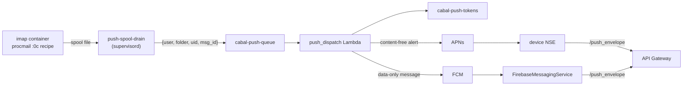

# Push notifications

The native clients receive new-mail notifications via their platforms'
push services — the Apple Push Notification service (APNs) for the Apple
clients, Firebase Cloud Messaging (FCM) for the Android client. The design
keeps message content out of Apple's and Google's infrastructure alike:
the server sends a content-free wake signal, and the device enriches it
locally before display.

## How it works



1. Procmail fires a carbon-copy (`:0c`) recipe after each local delivery on
   the `imap` tier. `push-enqueue.sh` writes one JSON wake signal into
   `/var/spool/cabal-push`; the `push-spool-drain` supervisord program
   forwards spool files to the `cabal-push-queue` SQS queue and ages out
   anything it cannot send within an hour. The split keeps the delivery path
   fast and credential-free: the per-user delivery agents never hold AWS
   credentials, and a slow or unreachable queue never blocks or fails mail
   delivery. Messages the spam rule files away are never enqueued.
2. The `push_dispatch` Lambda consumes the queue, looks up the recipient's
   registered device tokens in the `cabal-push-tokens` DynamoDB table,
   filters by each token's folder opt-in, and routes each row to its
   platform's sender: Apple rows (`ios`/`macos`) to APNs, `android` rows
   to FCM's HTTP v1 API. The APNs payload is `"New mail"` plus a message
   reference; the FCM message is data-only (no display text at all) with
   the same reference, sent at high priority with a one-hour TTL matching
   the queue's retention. Neither carries sender, subject, or body. Each
   sender's credential is checked independently: an environment with only
   one platform's credential provisioned delivers to that platform and
   drops the other's rows cleanly.
3. On the device, the app fetches sender/subject/snippet from
   `/push_envelope` with the user's own Cognito JWT and shows the enriched
   notification. On Apple platforms that is the Notification Service
   Extension rewriting the alert; on Android it is the app's
   `FirebaseMessagingService` posting a local notification (data-only FCM
   messages render nothing themselves). If enrichment fails (offline,
   token expired, timeout), the generic `"New mail"` alert ships instead.
   An Android app in the foreground suppresses the banner and refreshes
   the visible list, matching the Apple clients.
4. Devices register tokens through `/push_register` (on every app launch and
   token rotation) and remove them through `/push_deregister` (sign-out;
   the Android client also deregisters when notifications are toggled
   off). `push_dispatch` also prunes tokens the push service reports as
   gone (APNs `410 Unregistered`/`BadDeviceToken`; FCM `UNREGISTERED`,
   `INVALID_ARGUMENT`, `SENDER_ID_MISMATCH`), so an uninstalled app stops
   receiving pushes without operator involvement.

What APNs sees per push: the device token it already knows, the app's bundle
id, an AWS egress IP, and a payload containing only the alert text `"New
mail"`, a folder name, a UID integer, and a Message-ID string.

What Google sees per push is the same profile minus even the alert text:
the registration token it issued, the package name, an AWS egress IP, and
a data map of folder name, UID string, and Message-ID string. Message
content never transits Google — it exists only in the device's own
`/push_envelope` call.

Redelivery dedup differs by platform: APNs collapses on an
`apns-collapse-id` derived from the message identity; FCM's collapse keys
are unsuitable (at most four per offline device), so the Android app keys
notification ids on the message identity instead — a redelivered signal
replaces its own notification, and the same keying dedups push against
the app's fallback poller.

## Provisioning the APNs key

Push is inert until an APNs auth key is provisioned; without one,
`push_dispatch` logs that it is unconfigured and drops wake signals (they do
not pile up in the DLQ). Per environment:

1. In the [Apple Developer portal](https://developer.apple.com/account) →
   Certificates, Identifiers & Profiles → Keys, create a key with the
   **Apple Push Notifications service (APNs)** capability checked. This is
   an APNs *authentication key*, not an App Store Connect API key — if the
   form asks you to choose a role (Admin/Developer/...), you are on the
   wrong screen. Download the `.p8` file (one chance) and note the **Key
   ID** (shown on the key's page) and your **Team ID** (Membership
   details). The key has no expiry and no role; creating it requires the
   Admin or Account Holder role on your Apple account.
2. Populate the SSM parameters (from CloudShell in the target account):

   ```bash
   aws ssm put-parameter --name /cabal/apns/team_id --type SecureString \
     --value 'YOURTEAMID' --overwrite
   aws ssm put-parameter --name /cabal/apns/key_id --type SecureString \
     --value 'YOURKEYID' --overwrite
   aws ssm put-parameter --name /cabal/apns/private_key --type SecureString \
     --value file://AuthKey_YOURKEYID.p8 --overwrite
   ```

3. Check the endpoint matches how the app reaches devices. TestFlight and
   App Store builds register **production** tokens, so a deployment whose
   every environment installs from TestFlight keeps the default
   (production) endpoint everywhere and skips this step. Only
   development-signed builds (Xcode direct installs) register **sandbox**
   tokens:

   ```bash
   # only for an environment serving development-signed builds:
   aws ssm put-parameter --name /cabal/apns/endpoint --type SecureString \
     --value 'https://api.sandbox.push.apple.com' --overwrite
   ```

   A token sent to the wrong endpoint fails with `BadDeviceToken` and is
   pruned; re-launching the app re-registers it.

One key works for every app under the same team (iOS and macOS); the
dispatch Lambda selects the APNs topic from each token's registered bundle
id. The same key can be shared across environments or issued per environment
— Apple allows two active APNs keys per team, which is also what makes
rotation possible.

## Rotating the APNs key

The `.p8` key is high-value: whoever holds it can send arbitrary
notifications to every Cabalmail device. It is stored only in SSM
(SecureString), readable only by the `push_dispatch` Lambda role. To rotate:

1. Create a second APNs key in the Developer portal (do not revoke the old
   one yet).
2. Update `/cabal/apns/key_id` and `/cabal/apns/private_key` in each
   environment.
3. Wait for in-flight Lambda containers to recycle (or force it:
   `aws lambda update-function-configuration --function-name push_dispatch
   --description "key rotation $(date +%F)"`), and confirm pushes still
   arrive.
4. Revoke the old key in the Developer portal.

Revoking first inverts the order of operations and takes push down until the
new key lands everywhere.

## Provisioning the FCM credential

Android push is inert until a Firebase service-account key is provisioned;
without one, `push_dispatch` logs that FCM is unconfigured and drops
Android wake signals (Apple delivery is unaffected, and nothing piles up
in the DLQ). Per environment:

1. Create a **Firebase project** for the environment
   ([console.firebase.google.com](https://console.firebase.google.com)) —
   decline Google Analytics; it is not needed and adds a data-sharing
   surface. One project per environment: distinct sender IDs mean one
   environment's client builds cannot be pushed with another's
   credentials, mirroring the per-environment APNs posture.
2. Register the Android app in the project with the package name
   `com.cabalmail.android`. Note the four client-side values from Project
   settings (project ID, application ID, API key, sender ID / project
   number) — they configure client builds (below), not the server.
   `google-services.json` is never used; skip the download.
3. Create a **dedicated service account** in the underlying GCP project
   with only the Firebase Cloud Messaging API Admin role
   (`roles/firebasecloudmessaging.admin`) — not the default
   `firebase-adminsdk` account, which carries project-Editor. Generate a
   JSON key for it. This key is the FCM analog of the APNs `.p8`: whoever
   holds it can push arbitrary data messages to every registered Android
   device.
4. Seed SSM from CloudShell in the target account. Upload the JSON file
   via CloudShell's upload menu and reference it with `file://` — never
   paste the content inline, which risks silent truncation the dispatcher
   can only report as "service account unusable":

   ```bash
   aws ssm put-parameter --name /cabal/fcm/service_account \
     --type SecureString --value file://the-key.json --overwrite
   ```

   Delete the local JSON copy afterwards. No redeploy is needed — the
   Lambda re-checks an unconfigured verdict within five minutes.

## Rotating the FCM credential

The service-account JSON is stored only in SSM (SecureString), readable
only by the `push_dispatch` Lambda role. Google allows up to ten active
keys per service account, so rotation follows the APNs shape:

1. Generate a second key on the service account (do not delete the old one
   yet).
2. Update `/cabal/fcm/service_account` in each environment (`file://`, as
   above).
3. Wait for in-flight Lambda containers to recycle (or force it with a
   no-op `aws lambda update-function-configuration`), and confirm pushes
   still deliver.
4. Delete the old key in the Google console.

A key that ever transits the wrong environment's parameter (even briefly —
old versions remain readable in the parameter's history) should be treated
as burned: rotate it rather than reasoning about exposure.

## Apple client-side manual steps

The iOS app needs one-time Apple developer setup before push registration
works on real devices. The generic signing mechanics (certificates, profile
creation, secret encoding) live in
[docs/apple.md](apple.md#creating-provisioning-profiles); the
push-specific portal work, in order:

1. **Register the App Group** (Identifiers → ➕ → App Groups):
   `group.com.cabalmail.Cabalmail`. It carries the API URL and the mirrored
   Cognito token from the app to the Notification Service Extension.
2. **Add capabilities to the app's App ID** (`com.cabalmail.Cabalmail`):
   **Push Notifications**, and **App Groups** configured with the group
   above. Saving this warns that existing profiles are invalidated — that
   is step 4. Keychain sharing needs no portal capability.
3. **Register the NSE App ID** (`com.cabalmail.Cabalmail.NotificationService`,
   explicit) with **App Groups only** — the extension never registers for
   push itself, so it does not get the Push Notifications capability.
4. **Re-issue the app's App Store profile** (it turned Invalid in step 2:
   Profiles → click it → Edit → Save → Download) and **create the NSE's App
   Store profile** against the same Apple Distribution certificate. The one
   app profile covers both the iOS and visionOS upload legs; the watch
   profile belongs to an untouched App ID and is unaffected.
5. **Update the GitHub environment secrets** per environment: refresh
   `IOS_APP_STORE_PROFILE` with the re-issued profile and add
   `IOS_NSE_APP_STORE_PROFILE` (base64 each; stray whitespace is stripped
   by the workflow). Until the NSE secret exists, **both** TestFlight
   upload legs skip with a warning — it doubles as the "push signing assets
   are ready" sentinel, so neither leg can fail codesign against a stale
   profile.

The macOS app repeats the same shape with its own identifiers — the
backend needs nothing either way (the dispatch Lambda selects the APNs
topic per registered token, and the same APNs key covers every app on the
team):

- App Group: the same `group.com.cabalmail.Cabalmail`.
- `com.cabalmail.CabalmailMac`: **Push Notifications** + **App Groups**;
  re-issue its App Store profile afterwards.
- `com.cabalmail.CabalmailMac.NotificationService`: **App Groups only**,
  plus its own App Store profile — minted with
  `scripts/make-mac-profile.py` (needs the App Store Connect API `.p8`
  at hand), because the portal UI cannot produce macOS profiles for
  universal App IDs.
- Secrets: refresh `MAC_APP_STORE_PROFILE`, add
  `MAC_NSE_APP_STORE_PROFILE` (the macOS upload leg's skip-gate
  sentinel). The optional notarized-artifact leg additionally needs
  `MAC_NSE_DEVID_PROFILE` alongside the existing Developer ID pair.

On macOS the extension rarely gets to run: the system notification daemon
kills service extensions before they receive the notification (a
long-standing, unresolved platform defect). The dispatch Lambda therefore
sends Macs a *silent* push (`content-available: 1` with the `msgRef`, no
alert) instead of an alert push. A running Mac app — focused or not —
receives it, fetches the envelope, and posts an enriched local
notification itself: a full banner when the app is unfocused, sound only
(no banner) when it is frontmost, since the app already displays the mail.
If the fetch fails, the app posts a generic "New mail" notification
instead, so nothing is dropped silently. A quit Mac app receives no
notification at all — a deliberate trade, since the paired iPhone covers
that case with a fully enriched banner. That gap only opens when the
user quits explicitly, and two residency affordances (Settings >
Notifications) exist to make that rare: an opt-in launch-at-login item
(off until the user enables it; the toggle mirrors the system's
`SMAppService` status, pointing at System Settings > General > Login
Items when approval is pending) and a menu-bar presence (on by default)
whose status-item menu shows the Inbox unread count with Open / New
Message / Quit actions, keeping the app legibly alive with every window
closed. The extension ships regardless (a monthly automated check
watches for the macOS fix that would let it take over the quit-app case
without an app change).

## Android client configuration

There is no portal work on the Android side — no google-services plugin
and no `google-services.json`. The app builds `FirebaseOptions` manually
from four values baked in at compile time (`android/README.md` documents
the gradle properties):

- Local/device builds: `cabalmail.fcmProjectId`, `.fcmApplicationId`,
  `.fcmApiKey`, `.fcmSenderId` in `~/.gradle/gradle.properties`, from the
  Firebase console's app settings.
- Play Console uploads: the same values arrive as the `FCM_PROJECT_ID`,
  `FCM_APPLICATION_ID`, `FCM_API_KEY`, and `FCM_SENDER_ID` **variables**
  (not secrets — they ship inside every APK) on the `stage`/`prod` GitHub
  environments; the upload job passes them as `-P` flags. When any are
  unset the upload proceeds warn-green with push wired off.

The client degrades cleanly at every layer: a build without the values, a
device without Google Play services, or the notifications setting left
off all fall back to the 15-minute WorkManager poll (INBOX only). With
push active, registration is asserted on every launch, on token rotation,
and when the notifications toggle turns on; no FCM token exists before
the user opts in (`firebase_messaging_auto_init_enabled=false`).

User-facing behavior on Android:

- **Folder scope** (Settings → Notification folders): inbox only (the
  default), all folders, or an explicit selection — stored per device on
  its token row (`enabled_folders`), like the Apple clients, never in the
  synced preferences. The fallback poll stays inbox-only regardless.
- **Notification actions**: Mark as read and Archive. A tap dismisses the
  notification immediately and applies the change server-side in a
  retried background job. Archive moves to the auto-created `Archive`
  mailbox (the same destination as the in-app archive) and is omitted
  when the mail is already there.

Debugging: the registration and action paths log under the `cabal-push`
logcat tag, including the reason for every skipped registration; the
Firebase SDK's own logging can be raised per boot with
`adb shell setprop log.tag.FirebaseMessaging VERBOSE` (and kin) plus an
app restart.

## Operational notes

- **Queue and DLQ.** `cabal-push-queue` retains signals for one hour (a
  stale "new mail" push is noise, not news) and dead-letters to
  `cabal-push-dlq` after 5 failed receives. DLQ depth is visible in the SQS
  console; messages there are safe to purge — the mail itself was delivered
  normally.
- **Logs and metrics.** Dispatch logs at `/cabal/lambda/push_dispatch`
  (CloudWatch), including token prunes and per-send failures. Each
  invocation emits `Sent` / `Failed` / `LatencyMs` metrics in the
  `Cabal/Push` namespace via CloudWatch EMF, plus `Sent` / `Failed` lines
  dimensioned by `Platform` (`ios` / `macos` / `android`) so a
  single-sender failure mode is visible on its own.
- **Sender failure isolation.** An expired or revoked FCM credential
  surfaces as `Failed` with `Platform=android` and retryable errors aging
  into the DLQ while Apple sends continue untouched (and vice versa); the
  fix is an SSM re-seed, no deploy. A mixed-fleet user (an iPhone and an
  Android device on one account) gets one notification per device from a
  single queue signal — there is no cross-platform coordination to break.
- **Quiesce.** A quiesced environment delivers no mail, so nothing is
  enqueued. Residual signals from before the quiesce age out of the queue
  (and the container spool) within the hour. The Lambda itself costs nothing
  while idle and is not scaled down.
- **Spool.** `/var/spool/cabal-push` inside the imap container is sticky
  world-writable (like `/tmp`); the drain daemon authenticates each signal
  file by comparing its owner to the user it names, drops malformed or
  stale files, and the enqueue side sheds new signals if the spool backs up
  past 1000 files. The spool is container-local scratch — it is not on EFS
  and does not survive a task replacement, which loses at most the last
  seconds of wake signals, not mail.
- **Token hygiene.** `last_seen_at` on each `cabal-push-tokens` row is
  updated on registration and refreshed by successful pushes;
  `last_failure` records the most recent push-service rejection reason. Rows for
  uninstalled devices are pruned automatically on the next push attempt,
  and the weekly `push_token_gc` Lambda reaps rows idle for 90+ days as
  the backstop for devices no rejection ever surfaces (logs at
  `/cabal/lambda/push_token_gc`).
- **Enrichment during IMAP rolls.** `/push_envelope` returns 503 while a
  planned IMAP redeploy is in flight; devices fall back to the generic
  alert. Nothing needs doing.
