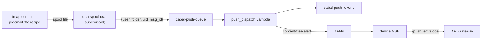

# Push notifications

The Apple clients receive new-mail notifications via the Apple Push
Notification service (APNs). The design keeps message content out of Apple's
infrastructure: the server sends a content-free wake signal, and the device
enriches it locally before display.

## How it works



1. Procmail fires a carbon-copy (`:0c`) recipe after each local delivery on
   the `imap` tier. `push-enqueue.sh` writes one JSON wake signal into
   `/var/spool/cabal-push`; the `push-spool-drain` supervisord program
   forwards spool files to the `cabal-push-queue` SQS queue and ages out
   anything it cannot send within an hour. The split keeps the delivery path
   fast and credential-free: the per-user delivery agents never hold AWS
   credentials, and a slow or unreachable queue never blocks or fails mail
   delivery. Messages the spam rule files away are never enqueued.
2. The `push_dispatch` Lambda consumes the queue, looks up the recipient's
   registered device tokens in the `cabal-push-tokens` DynamoDB table,
   filters by each token's folder opt-in, and sends one APNs request per
   device. The payload is `"New mail"` plus a message reference — no sender,
   subject, or body.
3. On the device, the app's Notification Service Extension calls
   `/push_envelope` with the user's own Cognito JWT to fetch
   sender/subject/snippet and rewrites the notification before it is shown.
   If that fails (offline, token expired, timeout), the generic `"New mail"`
   alert ships instead.
4. Devices register tokens through `/push_register` (on every app launch and
   token rotation) and remove them through `/push_deregister` (sign-out).
   `push_dispatch` also prunes tokens APNs reports as gone (`410
   Unregistered`, `BadDeviceToken`), so an uninstalled app stops receiving
   pushes without operator involvement.

What APNs sees per push: the device token it already knows, the app's bundle
id, an AWS egress IP, and a payload containing only the alert text `"New
mail"`, a folder name, a UID integer, and a Message-ID string.

## Provisioning the APNs key

Push is inert until an APNs auth key is provisioned; without one,
`push_dispatch` logs that it is unconfigured and drops wake signals (they do
not pile up in the DLQ). Per environment:

1. In the [Apple Developer portal](https://developer.apple.com/account) →
   Certificates, Identifiers & Profiles → Keys, create a key with the
   **Apple Push Notifications service (APNs)** capability checked. This is
   an APNs *authentication key*, not an App Store Connect API key — if the
   form asks you to choose a role (Admin/Developer/...), you are on the
   wrong screen. Download the `.p8` file (one chance) and note the **Key
   ID** (shown on the key's page) and your **Team ID** (Membership
   details). The key has no expiry and no role; creating it requires the
   Admin or Account Holder role on your Apple account.
2. Populate the SSM parameters (from CloudShell in the target account):

   ```bash
   aws ssm put-parameter --name /cabal/apns/team_id --type SecureString \
     --value 'YOURTEAMID' --overwrite
   aws ssm put-parameter --name /cabal/apns/key_id --type SecureString \
     --value 'YOURKEYID' --overwrite
   aws ssm put-parameter --name /cabal/apns/private_key --type SecureString \
     --value file://AuthKey_YOURKEYID.p8 --overwrite
   ```

3. Check the endpoint matches how the app reaches devices. TestFlight and
   App Store builds register **production** tokens, so a deployment whose
   every environment installs from TestFlight keeps the default
   (production) endpoint everywhere and skips this step. Only
   development-signed builds (Xcode direct installs) register **sandbox**
   tokens:

   ```bash
   # only for an environment serving development-signed builds:
   aws ssm put-parameter --name /cabal/apns/endpoint --type SecureString \
     --value 'https://api.sandbox.push.apple.com' --overwrite
   ```

   A token sent to the wrong endpoint fails with `BadDeviceToken` and is
   pruned; re-launching the app re-registers it.

One key works for every app under the same team (iOS and macOS); the
dispatch Lambda selects the APNs topic from each token's registered bundle
id. The same key can be shared across environments or issued per environment
— Apple allows two active APNs keys per team, which is also what makes
rotation possible.

## Rotating the APNs key

The `.p8` key is high-value: whoever holds it can send arbitrary
notifications to every Cabalmail device. It is stored only in SSM
(SecureString), readable only by the `push_dispatch` Lambda role. To rotate:

1. Create a second APNs key in the Developer portal (do not revoke the old
   one yet).
2. Update `/cabal/apns/key_id` and `/cabal/apns/private_key` in each
   environment.
3. Wait for in-flight Lambda containers to recycle (or force it:
   `aws lambda update-function-configuration --function-name push_dispatch
   --description "key rotation $(date +%F)"`), and confirm pushes still
   arrive.
4. Revoke the old key in the Developer portal.

Revoking first inverts the order of operations and takes push down until the
new key lands everywhere.

## Client-side manual steps

The iOS app needs one-time Apple developer setup before push registration
works on real devices. The generic signing mechanics (certificates, profile
creation, secret encoding) live in
[apple/README.md](../apple/README.md#creating-provisioning-profiles); the
push-specific portal work, in order:

1. **Register the App Group** (Identifiers → ➕ → App Groups):
   `group.com.cabalmail.Cabalmail`. It carries the API URL and the mirrored
   Cognito token from the app to the Notification Service Extension.
2. **Add capabilities to the app's App ID** (`com.cabalmail.Cabalmail`):
   **Push Notifications**, and **App Groups** configured with the group
   above. Saving this warns that existing profiles are invalidated — that
   is step 4. Keychain sharing needs no portal capability.
3. **Register the NSE App ID** (`com.cabalmail.Cabalmail.NotificationService`,
   explicit) with **App Groups only** — the extension never registers for
   push itself, so it does not get the Push Notifications capability.
4. **Re-issue the app's App Store profile** (it turned Invalid in step 2:
   Profiles → click it → Edit → Save → Download) and **create the NSE's App
   Store profile** against the same Apple Distribution certificate. The one
   app profile covers both the iOS and visionOS upload legs; the watch
   profile belongs to an untouched App ID and is unaffected.
5. **Update the GitHub environment secrets** per environment: refresh
   `IOS_APP_STORE_PROFILE` with the re-issued profile and add
   `IOS_NSE_APP_STORE_PROFILE` (base64 each; stray whitespace is stripped
   by the workflow). Until the NSE secret exists, **both** TestFlight
   upload legs skip with a warning — it doubles as the "push signing assets
   are ready" sentinel, so neither leg can fail codesign against a stale
   profile.

The macOS app repeats the same shape with its own identifiers — the
backend needs nothing either way (the dispatch Lambda selects the APNs
topic per registered token, and the same APNs key covers every app on the
team):

- App Group: the same `group.com.cabalmail.Cabalmail`.
- `com.cabalmail.CabalmailMac`: **Push Notifications** + **App Groups**;
  re-issue its App Store profile afterwards.
- `com.cabalmail.CabalmailMac.NotificationService`: **App Groups only**,
  plus its own App Store profile.
- Secrets: refresh `MAC_APP_STORE_PROFILE`, add
  `MAC_NSE_APP_STORE_PROFILE` (the macOS upload leg's skip-gate
  sentinel). The optional notarized-artifact leg additionally needs
  `MAC_NSE_DEVID_PROFILE` alongside the existing Developer ID pair.

## Operational notes

- **Queue and DLQ.** `cabal-push-queue` retains signals for one hour (a
  stale "new mail" push is noise, not news) and dead-letters to
  `cabal-push-dlq` after 5 failed receives. DLQ depth is visible in the SQS
  console; messages there are safe to purge — the mail itself was delivered
  normally.
- **Logs and metrics.** Dispatch logs at `/cabal/lambda/push_dispatch`
  (CloudWatch), including token prunes and per-send failures. Each
  invocation emits `Sent` / `Failed` / `LatencyMs` metrics in the
  `Cabal/Push` namespace via CloudWatch EMF.
- **Quiesce.** A quiesced environment delivers no mail, so nothing is
  enqueued. Residual signals from before the quiesce age out of the queue
  (and the container spool) within the hour. The Lambda itself costs nothing
  while idle and is not scaled down.
- **Spool.** `/var/spool/cabal-push` inside the imap container is sticky
  world-writable (like `/tmp`); the drain daemon authenticates each signal
  file by comparing its owner to the user it names, drops malformed or
  stale files, and the enqueue side sheds new signals if the spool backs up
  past 1000 files. The spool is container-local scratch — it is not on EFS
  and does not survive a task replacement, which loses at most the last
  seconds of wake signals, not mail.
- **Token hygiene.** `last_seen_at` on each `cabal-push-tokens` row is
  updated on registration and refreshed by successful pushes;
  `last_failure` records the most recent APNs rejection reason. Rows for
  uninstalled devices are pruned automatically on the next push attempt,
  and the weekly `push_token_gc` Lambda reaps rows idle for 90+ days as
  the backstop for devices no rejection ever surfaces (logs at
  `/cabal/lambda/push_token_gc`).
- **Enrichment during IMAP rolls.** `/push_envelope` returns 503 while a
  planned IMAP redeploy is in flight; devices fall back to the generic
  alert. Nothing needs doing.
