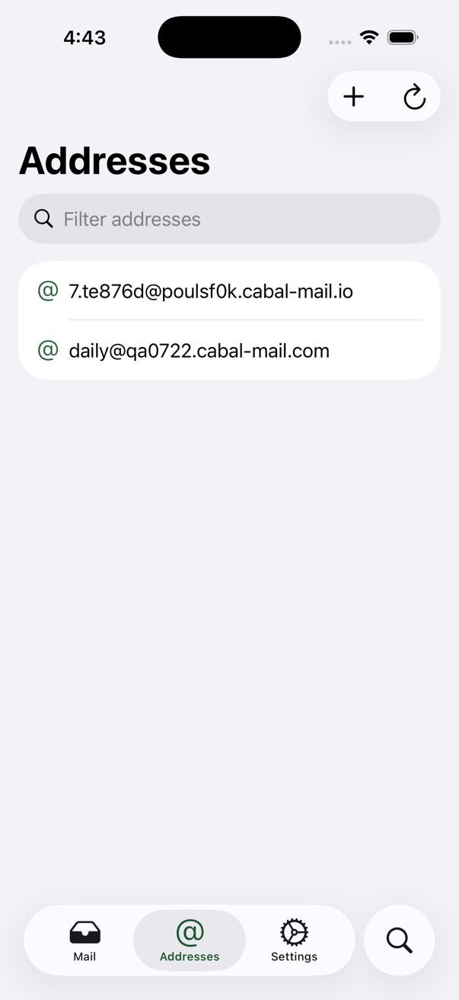
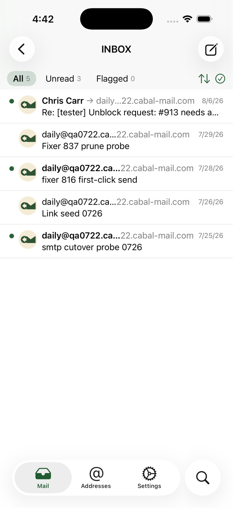
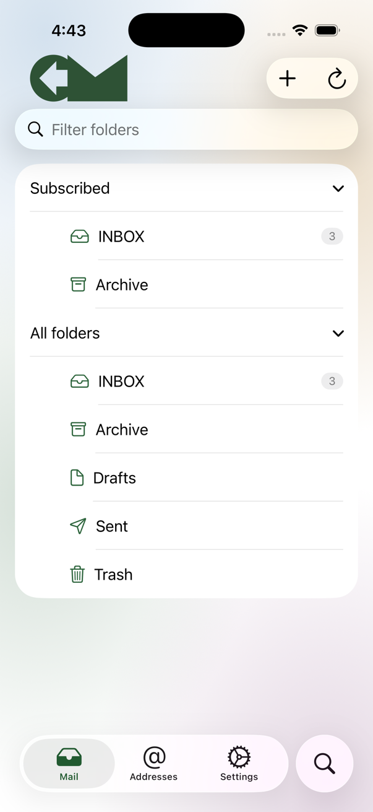
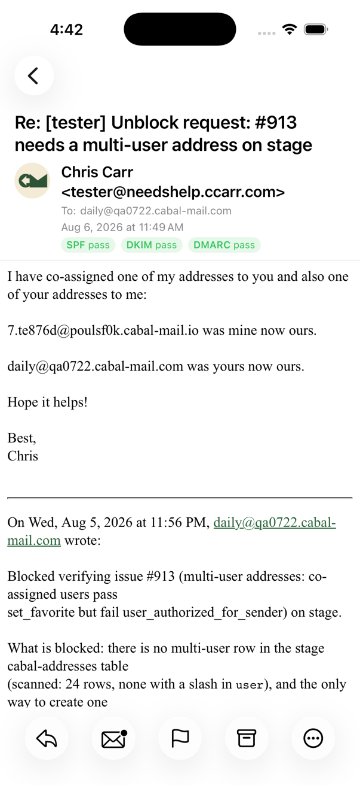
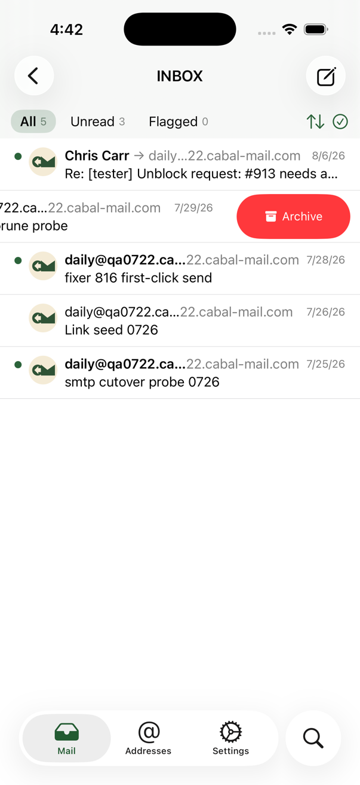

# Cabalmail User Manual

Cabalmail gives you one inbox and as many addresses as you want. Create a fresh address every time you hand out your contact information; when one starts attracting spam, revoke it and the spammers lose the ability to reach your servers at all.

Use the **native Apple apps** — iPhone, iPad, Mac, and Apple Vision Pro, plus an Apple Watch companion — for day-to-day mail. They carry the full experience: mail, addresses, folders, search, drafts. Android and Linux clients are planned.

**Webmail** at `https://admin.example.net/` (substituting your control domain) remains supported, but the admin site is best reserved for account signup, password recovery, and — for administrators — the admin dashboard.

Generic mail clients (Thunderbird, Apple Mail, Outlook, …) cannot be connected; there are no public IMAP or SMTP endpoints ([details](./mua_setup.md)).

## Accounts and signing in

**Creating an account.** Use the web app's Sign up form. If your operator configured an invitation code, you must enter it. After sign-up, wait for an administrator to approve your account.

**Signing in.** Username and password, then — if you are enrolled in two-factor authentication — a 6-digit code from your authenticator app (the Apple apps submit it automatically when the sixth digit lands). Operators can make two-factor mandatory; when it is, signing in without an enrolled authenticator walks you through enrollment (scan the QR code, confirm the first code) before you can proceed. You can also enroll voluntarily from the web app.

**Recovery.** Password reset is self-service by SMS where the operator has SMS configured; otherwise ask your administrator. If you lose your authenticator, an administrator must reset your MFA.

## Addresses

Every address lives on its own subdomain (`foo@bar.example.com`) and delivers to your one inbox.

- **Create** a named address, or use **Random** for signup forms. Record who got it in the comment field — that is how you find it later. New addresses are usable within a minute or two.
- **Copy** an address to the clipboard from the list; **favorite** the ones you use often (favorites are per-user).
- **Suspend** an address to make it stop receiving, reversibly: its DNS records are withdrawn but the address is kept and can be **reinstated** later. On the Apple apps, suspend/reinstate are swipe actions on the address list.
- **Revoke** an address to delete it permanently — the address, and its DNS, are gone for good. You can also revoke the receiving address right from a message you are reading.
- **Shared addresses.** An administrator can assign one address to several users; each assignee receives its mail in their own inbox.
- Administrators may limit which mail domains you can create addresses on.

## Mail

- **Folders.** Create, delete, and subscribe to folders; favorites sort to the top of pickers. Subscribed folders are refreshed proactively; unsubscribed folders load only when you open them.

  
- **Reading.** Remote images are blocked by default (load them per message; loading can let a sender track you). A sender-authentication line shows the SPF/DKIM/DMARC verdicts stamped by your own relay, or "not verified" when there are none. Sender avatars come from your Contacts, the sender's published BIMI logo, or initials.

  
- **Search** is full-text across folders (Trash excluded). Text inside attachments is not indexed.
- **Triage.** Swipe right to toggle read/unread; swipe left to archive (inside Archive, the same gesture restores). Multi-select for bulk move, flag, read/unread, and delete. Filter the list (All / Unread / Flagged) and change the sort order from the toolbar.

  
- **Trash.** Deleting moves a message to Trash. Permanent deletion — per message or Empty Trash — happens only inside Trash and cannot be undone.
- **Drafts** autosave and sync through the Drafts folder: start a reply on one device, finish it on another.
- **Compose** supports rich text and attachments; replies pick the From address and recipients from the original message, and forwards carry the original attachments.

## Siri and Shortcuts (iPhone and iPad)

Four intents work with Siri, the Shortcuts app, and Spotlight: mint a random address (copied to the clipboard), create a named address, check the inbox (unread count and latest senders), and open a folder by name. When invoked by voice, iOS requires one tap ("Continue") before the app may write to your clipboard.

## Apple Watch

The Watch companion manages addresses only — mint, list, and revoke from the wrist, with a large-type view for reading an address to someone. It installs alongside the iPhone app.

## Contacts (Apple apps)

At first sign-in the app asks for Contacts access (optional). Contact names and photos label message lists and avatars, and compose autocompletes recipients from your contacts; you can add a correspondent to Contacts from a message header. Lookups happen on your device — no contact data is ever sent to the server.

## Administration

Administrators are members of the `admin` group in the Cognito user pool. Granting that membership is done in the AWS Cognito console (add user to group) — the one administrative act still performed in AWS. Everything else is in the web app, which shows admins additional views:

- **Users** — approve pending sign-ups, disable, or delete accounts.
- **Addresses** — see every address in the system, create addresses on behalf of users, and assign an address to one or more users.
- **Domain access** — restrict which mail domains each user may create addresses on.
- **DMARC** — browse aggregate reports, auto-ingested every six hours from the system's report mailbox.
- **CAA** — review certificate-issuance violation reports ([details](./caa.md)).
- **DNS** — per-address health check with a Repair button that republishes missing records. Apex-domain problems are flagged but never auto-repaired.

Operators can require two-factor authentication for admins or for all users; see [GitHub setup](./github.md) for the enforcement variables and [operations](./operations.md) for day-to-day system care.
