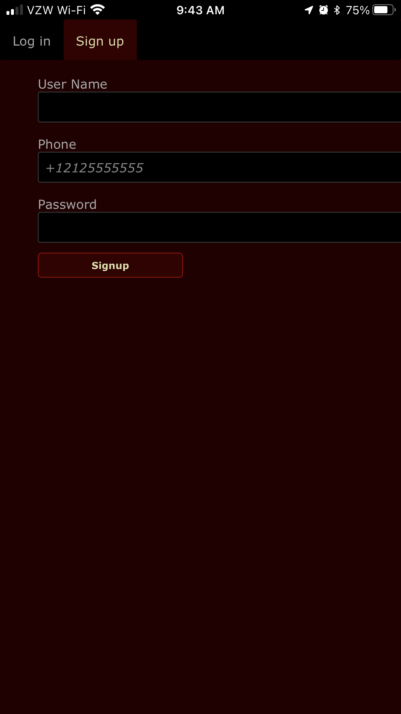
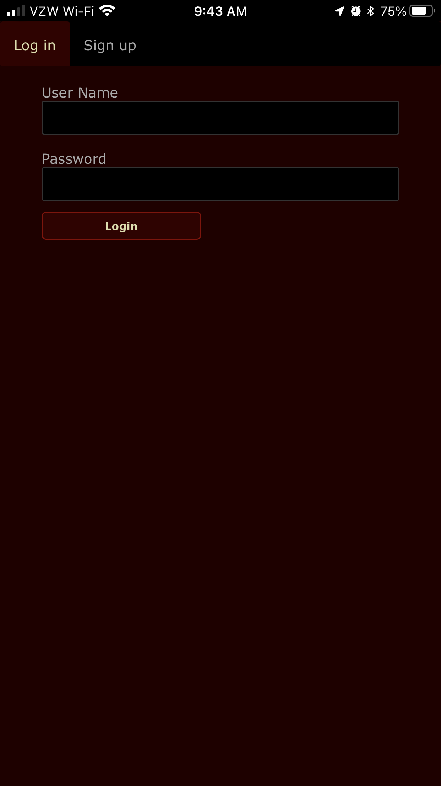
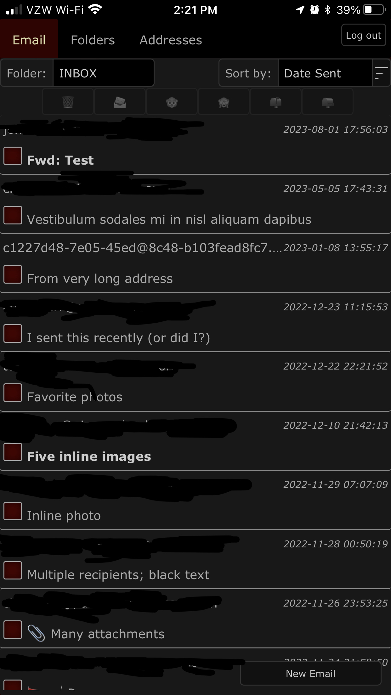
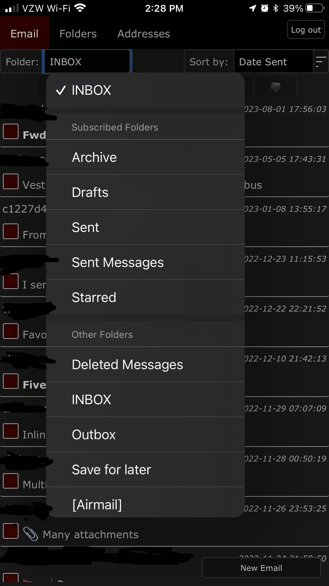
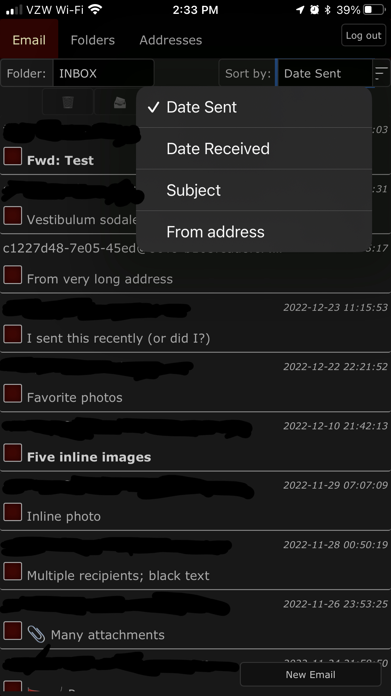
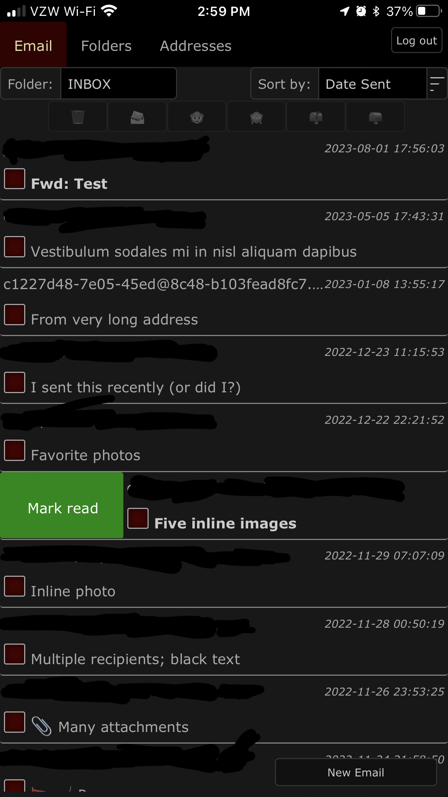
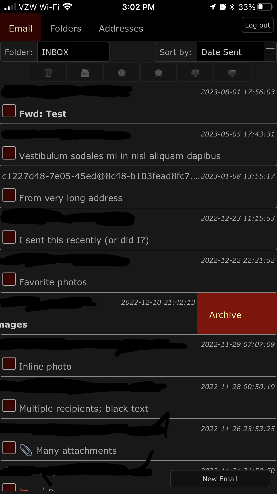
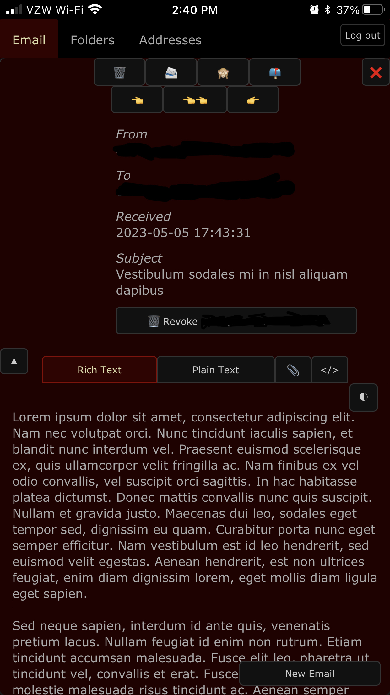

# Cabalmail App
The included serverless app can be used to create and revoke email addresses.

## Personas

[End User](#user)
: Creates and revokes email addresses for their own use

[Administrator](#admin)
: Approves or rejects requests to create new accounts

## Working with the App (End User)
As an end user, you must first establish an account. Once approved, you can use the app to create and revoke addresses. All addresses that you create are aliased to a single inbox. You can reach the app at `https://admin.example.net/` (substituting your control domain for `example.net`).

### _Creating an Account_
1. Visit the login page at the admin URL.

2. Click or tap "Sign up" in the main tab bar.

    

3. Fill out the form. All fields are mandatory. When done, tap or click the "Signup" button.

4. Wait for an administrator to approve your account.

### _Loging in_
1. Visit the login page at the admin URL.

2. Enter your username and password.

    

3. Tap or click the "Login" button.

### _Working with Addresses_

Click or tap on "Addresses" in the main tab bar to request a new address, list addresses, or revoke an address.

#### Requesting an Address

1. From the Addresses screen, click or tap on the "New Address" button to reveal a form.

    

2. Fill out the form, or use the "Random" button to quickly create a unique address suitable for online contact forms. All fields are mandatory except the Comment field. (For "Comment", we recommend that you record the name of the person or company to whom you intend to give the address. This will help locate it later, especially if you used the "Random" button.) When done, tap or click on the "Request" button.

3. After a moment, a popup will appear informing you that the address has been requested. It is generally safe to begin using the address within a minute or two. As a convenience, the app scrolls the new address into view.

    

4. Optionally, tap the 📋 button to copy the address into your system clipboard.

    

#### Listing Your Addresses
A list of your addresses can be accessed by tapping or clicking the "Addresses" tab in the main tab bar. At the top of this screen, you can filter by arbitrary text.

#### Copying an Address
You can copy an address to your clipboard by tapping or clicking the adjascent 📋 button from the list screen.

#### Revoking an Address
1. Locate the offending address on the list screen. Use the filter to help narrow down the list.

    

2. Tap or click the 🗑️ button.

    

### _Working with Folders_

Click or tap on "Folders" in the main tab bar to create new folders, list folders, delete folders, and designate favorite folders.

#### Creating a Folder

To create a top-level folder:

1. Enter the desired name in the text field.

2. Tap or click the "New Top-level Folder" button.

To create a subfolder:

1. Enter the desired name in the text field.

2. Tap or click the 📁 button of the desired parent folder.

#### Delete a Folder

To delete a folder, tap or click the 🗑️ button adjascent to the folder you want to delete. Note that deletion proceeds immediately without further warning, and that messages in the folder cannot be recovered.

#### Designate a Folder as a Favorite

To designate a folder as a favorite, tap or click the ☆ button adjacent to the deisred folder.

#### Remove Favorite Designation

To remove a folder from your favorites, tap or click the ★ button adjacent to the deisred folder.

### _Working with Email_

Click or tap on "Email" in the main tab bar to access the webmail client. The webmail client provides all standard email operations, including reading and composing. While composing an email, you can create a new sender address on the fly. While reading an email, you can revoke the receiving address to prevent further abuse.

#### Changing Folders

The Email screen defaults to "INBOX". To view messages in another folder, tap or click the "Folder:" drop-down in the upper-left, and select the desired folder from the list. The drop-down places "INBOX" at the top, followed by a list of your favorite folders in alphabetical order, followed by a list of other folders in alphabetical order.

#### Changing how Messages are Sorted

The Email screen defaults to sorting by descending Date Sent. Change the sort field to Date Received, Subject, or From address by tapping or clicking the Sort by drop-down in the upper-right, and select the desired sort field. Toggle between ascending/descending by tapping or clicking the button with three horizontal lines immediately to the right of the Sort by drop-down.

#### Using Swipe Gestures

The message list supports two swipe gestures.

1. Swipe from left to right to toggle between read and unread states.

    

2. Swipe from right to left to archive a message. Archiving marks a message as read and moves it to an Archive folder

    

#### Bulk Operations on Messages

By tapping or clicking the checkboxes to the left of each message, you can select them for bulk operations. The buttons along the top of the message list will perform the following operations on the checked messages:

🗑️: Delete message (can't be undone).

📨: Move message to another folder.

🙈: Mark message as unread.

🐵: Mark message as read.

📭: Remove flag from message.

📫: Add flag to message.

#### Reading a Message

Tap or click the subject of an email in the message list to see the full email. Wide screen devices show the message to the right of the message list. Narrow screen devices show only the message; you can return to the message list by tapping the ❌ button in the upper right.

There are a number of options available while reading a message:

🗑️: Delete message (can't be undone).

📨: Move message to another folder.

🙈: Mark message as unread.

🐵: Mark message as read.

📭: Remove flag from message.

📫: Add flag to message.

👈: Reply to sender.

👈👈: Reply to all.

👉: Forward message.

🗑️ Revoke \_\_\_\_\_: Revoke the address that received the message.

▲: Hide most header information in order to see more of the message body.

▼: Show the full header information.

Rich Text: Show the HTML version of the message if present (default view).

Plain Text: Show the plain text version of the message if present.

📎: Show list of attachments.

\</\>: Show message source.

The following options only pertain to the Rich Text view:

<ins>⇩</ins>: Download external images (may allow sender to track you).

◐: Rotate through different views. There are three states:

- Default. Text and background color match system defaults. This means dark text and light background for systems with a bright default, and light text and dark background for systems with a dark default.
- Message style. No styling is applied apart from what is embedded in the message.
- Inverted. Oposite of default.

#### Composing a Message

### _Log Out_
When done, log out of the application by tapping or clicking the "Log out" button in the upper right.

## Managing Accounts (Administrator)

Cabalmail does not create a custom user interface for administering end user accounts. Rather, this is done in the AWS Cognito console.

### _Approving Account Requests_
1. Log in to your AWS account using the IAM user that you created during [AWS setup step 2](./aws.md).
2. Make sure you are in the correct AWS region (as specified in your GitHub environment variables). Use the menu in the upper right of the AWS console if you need to change regions.
3. Navigate to [Cognito](https://console.aws.amazon.com/cognito/home).
4. Click the "Manage User Pools" button.
5. Click on the "cabal" user pool.
6. In the left navigation, click on "Users and groups" under the heading "General settings".
7. Click on the user name of the user who you want to approve.
8. Examine the user's details to verify that you selected the right one.
9. Click the "Enable user" button.

### _Disabling an Account_
1. Log in to your AWS account using the IAM user that you created during [AWS setup step 2](./aws.md).
2. Make sure you are in the correct AWS region (as specified in your Terraform variables). Use the menu in the upper right of the AWS console if you need to change regions.
3. Navigate to [Cognito](https://console.aws.amazon.com/cognito/home).
4. Click the "Manage User Pools" button.
5. Click on the "cabal" user pool.
6. In the left navigation, click on "Users and groups" under the heading "General settings".
7. Click on the user name of the user who you want to disable.
8. Examine the user's details to verify that you selected the right one.
9. Click the "Disable user" button.

### Deleting an Account
1. Follow the steps in [Disabling an Account](#disable).
2. Click the "Delete user" button.