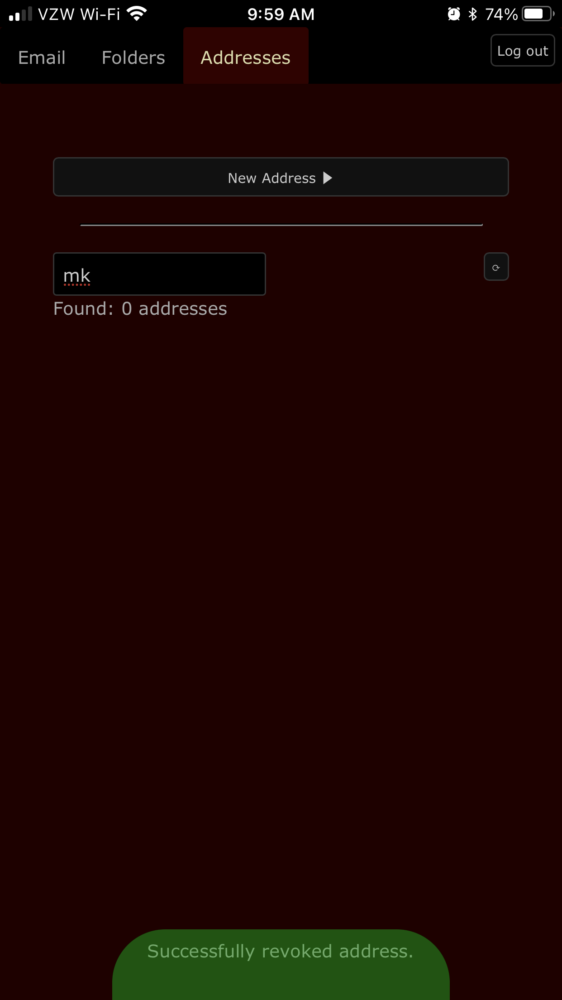

# Cabalmail App
The included serverless app can be used to create and revoke email addresses.

## Personas

[End User](#user)
: Creates and revokes email addresses for their own use

[Administrator](#admin)
: Approves or rejects requests to create new accounts

## Working with the App (End User)
As an end user, you must first establish an account. Once approved, you can use the app to create and revoke addresses. All addresses that you create are aliased to a single inbox. You can reach the app at `https://admin.example.net/` (substituting your control domain for `example.net`).

### Creating an Account
1. Visit the login page at the admin URL.

2. Click or tap "Sign up" in the main tab bar.

    

3. Fill out the form. All fields are mandatory. When done, tap or click the "Signup" button.

4. Wait for an administrator to approve your account.

### Loging in
1. Visit the login page at the admin URL.

2. Enter your username and password.

    

3. Tap or click the "Login" button.

### Working with Addresses

Click or tap on "Addresses" in the main tab bar to request a new address, list addresses, or revoke an address.

#### Requesting an Address

1. From the Addresses screen, click or tap on the "New Address" button to reveal a form.

    

2. Fill out the form, or use the "Random" button to quickly create a unique address suitable for online contact forms. All fields are mandatory except the Comment field. (For "Comment", we recommend that you record the name of the person or company to whom you intend to give the address. This will help locate it later, especially if you used the "Random" button.) When done, tap or click on the "Request" button.

3. After a moment, a popup will appear informing you that the address has been requested. It is generally safe to begin using the address within a minute or two. As a convenience, the app scrolls the new address into view.

    

4. Optionally, tap the 📋 button to copy the address into your system clipboard.

    

#### Listing Your Addresses
A list of your addresses can be accessed by tapping or clicking the "Addresses" tab in the main tab bar. At the top of this screen, you can filter by arbitrary text.

#### Copying an Address
You can copy an address to your clipboard by tapping or clicking the adjascent 📋 button from the list screen.

#### Revoking an Address
1. Locate the offending address on the list screen. Use the filter to help narrow down the list.

    

2. Tap or click the 🗑️ button.

    

### Working with Folders

Click or tap on "Folders" in the main tab bar to create new folders, list folders, delete folders, and designate favorite folders.

#### Creating a Folder

#### Delete a Folder

#### Designate a Folder as a Favorite

#### Remove Favorite Designation

### Working with Email

Click or tap on "Email" in the main tab bar to access the webmail client. The webmail client provides all standard email operations, including reading and composing. While composing an email, you can create a new sender address on the fly. While reading an email, you can revoke the receiving address to prevent further abuse.

#### Changing Folders

#### Changing how Messages are Sorted

#### Reading a Message

#### Composing a New Message

#### Replying to a Message

### Log Out
When done, log out of the application by tapping the exit-door icon in the lower right (mobile) or clicking on the "Sign out" button in the upper right (desktop).

## Managing Accounts (Administrator)

Cabalmail does not create a custom user interface for administering end user accounts. Rather, this is done in the AWS Cognito console.

### Approving Account Requests
1. Log in to your AWS account using the IAM user that you created during [AWS setup step 2](./aws.md).
2. Make sure you are in the correct AWS region (as specified in your Terraform variables). Use the menu in the upper right of the AWS console if you need to change regions.
3. Navigate to [Cognito](https://console.aws.amazon.com/cognito/home).
4. Click the "Manage User Pools" button.
5. Click on the "cabal" user pool.
6. In the left navigation, click on "Users and groups" under the heading "General settings".
7. Click on the user name of the user who you want to approve.
8. Examine the user's details to verify that you selected the right one.
9. Click the "Enable user" button.

### Disabling an Account
1. Log in to your AWS account using the IAM user that you created during [AWS setup step 2](./aws.md).
2. Make sure you are in the correct AWS region (as specified in your Terraform variables). Use the menu in the upper right of the AWS console if you need to change regions.
3. Navigate to [Cognito](https://console.aws.amazon.com/cognito/home).
4. Click the "Manage User Pools" button.
5. Click on the "cabal" user pool.
6. In the left navigation, click on "Users and groups" under the heading "General settings".
7. Click on the user name of the user who you want to disable.
8. Examine the user's details to verify that you selected the right one.
9. Click the "Disable user" button.

### Deleting an Account
1. Follow the steps in [Disabling an Account](#disable).
2. Click the "Delete user" button.